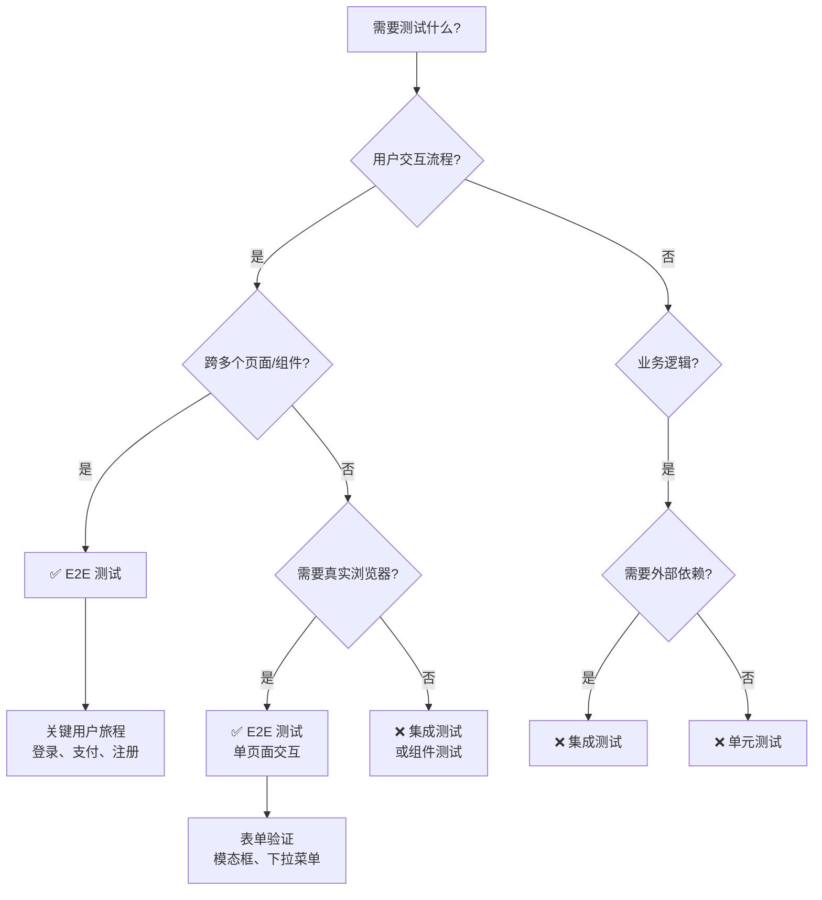

# E2E 测试最佳实践

## 何时使用此技能

使用此技能当你需要：
- 测试关键用户流程（登录、支付、核心业务流程）
- 不确定何时使用 E2E vs 单元测试 vs 集成测试
- E2E 测试不稳定，需要改进可靠性
- 想了解 Agent Browser vs Playwright 的区别
- 需要"侦察-然后-行动"模式指导（动态 Web 应用）

## 与其他工具的关系

- **e2e-runner 智能体**：执行测试、生成代码、管理产物（工具层）
- **本技能**：提供方法论和最佳实践（知识层）
- **tdd-workflow**：整体测试策略和 TDD 流程（流程层）

**使用建议**：
1. 先阅读本技能了解方法论
2. 使用 `/e2e` 命令或调用 e2e-runner 智能体执行测试
3. 遵循 tdd-workflow 确保测试覆盖率

---

## 决策树：何时使用 E2E 测试



### 测试类型对比

| 测试类型 | 适用场景 | 速度 | 成本 | 可靠性 |
|---------|---------|------|------|--------|
| **E2E 测试** | 关键用户流程、多页面交互 | 慢 | 高 | 中等（易受环境影响） |
| **集成测试** | API 端点、数据库操作、服务集成 | 中 | 中 | 高 |
| **单元测试** | 纯函数、业务逻辑、工具函数 | 快 | 低 | 高 |

### 何时使用 E2E 测试

✅ **应该使用 E2E 测试**：
- 关键用户旅程（登录、注册、支付、核心业务流程）
- 多步骤流程验证（购物车 → 结账 → 支付 → 确认）
- 前后端集成验证（表单提交 → API 调用 → 数据库更新 → UI 反馈）
- 需要真实浏览器环境（JavaScript 执行、CSS 渲染、浏览器 API）

❌ **不应该使用 E2E 测试**：
- 纯业务逻辑（使用单元测试）
- API 端点测试（使用集成测试）
- 边界条件和错误处理（使用单元测试）
- 性能测试（使用专门的性能测试工具）

---

## 工具选择：Agent Browser vs Playwright

### Agent Browser（推荐）

**优势**：
- 🤖 **AI 优化**：专为 LLM 驱动的浏览器自动化设计
- 🎯 **语义选择器**：通过含义查找元素，而非脆弱的 CSS/XPath
- ⏱️ **自动等待**：智能等待动态内容加载
- 🔧 **基于 Playwright**：完整兼容 Playwright 作为备选方案

**适用场景**：
- 大多数 E2E 测试场景
- 动态内容较多的现代 Web 应用
- 需要快速编写测试，不想手动管理选择器
- 团队使用 AI 辅助开发

**示例**（CLI）：
```bash
# 打开页面并获取快照
agent-browser open https://example.com
agent-browser snapshot -i  # 返回带引用的元素 [ref=e1]

# 使用引用进行交互
agent-browser click @e1                      # 点击按钮
agent-browser fill @e2 "user@example.com"   # 填充输入框
agent-browser wait visible @e5               # 等待元素可见
```

### Playwright + 侦察-然后-行动（高级场景）

**优势**：
- 🔍 **精细控制**：完全控制浏览器行为
- 🛠️ **灵活性**：支持复杂的测试场景
- 📊 **成熟生态**：丰富的插件和工具

**适用场景**：
- 需要精细控制浏览器行为
- 复杂的测试场景（多窗口、iframe、文件上传）
- 动态内容非常复杂，需要手动管理等待
- 已有 Playwright 测试基础设施

**何时使用侦察-然后-行动模式**：
- 动态 Web 应用（React、Vue、Angular）
- 选择器不稳定，需要先检查 DOM
- 不确定元素何时出现
- 需要调试测试失败原因

---

## 核心模式：侦察-然后-行动（Playwright）

### 为什么需要这个模式

**问题**：动态 Web 应用的挑战
- JavaScript 动态生成 DOM
- 异步数据加载
- 选择器在运行时才确定
- 元素出现时机不确定

**传统方法的问题**：
```typescript
// ❌ 错误：盲目猜测选择器
await page.click('.submit-button')  // 可能不存在或选择器错误
```

**侦察-然后-行动的优势**：
- ✅ 先看到页面实际状态
- ✅ 识别正确的选择器
- ✅ 避免盲目猜测
- ✅ 提高测试可靠性

### 步骤 1：侦察（Reconnaissance）

**目标**：了解页面的实际状态

#### TypeScript 示例

```typescript
import { test } from '@playwright/test'

test('login flow - reconnaissance', async ({ page }) => {
  // 1. 导航到页面
  await page.goto('http://localhost:3000/login')

  // 2. 等待页面完全加载（关键！）
  await page.waitForLoadState('networkidle')

  // 3. 截图查看页面
  await page.screenshot({ path: '/tmp/login-page.png' })

  // 4. 检查 DOM 结构
  const content = await page.content()
  console.log(content)

  // 5. 列出所有交互元素
  const buttons = await page.locator('button').all()
  for (const button of buttons) {
    const text = await button.textContent()
    console.log(`Button: ${text}`)
  }
})
```

#### Python 示例

```python
from playwright.sync_api import sync_playwright

def test_login_reconnaissance():
    with sync_playwright() as p:
        browser = p.chromium.launch()
        page = browser.new_page()

        # 1. 导航到页面
        page.goto('http://localhost:3000/login')

        # 2. 等待页面完全加载（关键！）
        page.wait_for_load_state('networkidle')

        # 3. 截图查看页面
        page.screenshot(path='/tmp/login-page.png')

        # 4. 检查 DOM 结构
        content = page.content()
        print(content)

        # 5. 列出所有交互元素
        buttons = page.locator('button').all()
        for button in buttons:
            print(f"Button: {button.text_content()}")

        browser.close()
```

**关键点**：
- ⚠️ **必须等待 `networkidle`**：确保动态内容加载完成
- 📸 **截图**：直观查看页面状态
- 🔍 **检查 DOM**：了解实际的 HTML 结构
- 📝 **列出元素**：找到所有可交互的元素

### 步骤 2：识别选择器

**选择器优先级**（从高到低）：

1. **语义选择器**（最推荐）
   ```typescript
   page.getByRole('button', { name: 'Submit' })
   page.getByLabel('Email')
   page.getByPlaceholder('Enter your email')
   page.getByText('Welcome')
   ```

2. **测试 ID**（推荐）
   ```typescript
   page.getByTestId('submit-button')
   // HTML: <button data-testid="submit-button">Submit</button>
   ```

3. **CSS 选择器**（不推荐，易碎）
   ```typescript
   page.locator('.btn-primary')  // 样式变化会导致失败
   ```

4. **XPath**（最不推荐）
   ```typescript
   page.locator('//button[@class="btn-primary"]')  // 难以维护
   ```

**最佳实践**：
- ✅ 优先使用语义选择器（role、label、text）
- ✅ 为关键元素添加 `data-testid`
- ❌ 避免依赖 CSS 类名（易变）
- ❌ 避免使用 XPath（难以阅读和维护）

### 步骤 3：执行操作

**使用侦察中识别的选择器**：

#### TypeScript 示例

```typescript
import { test, expect } from '@playwright/test'

test('login flow - complete', async ({ page }) => {
  // 导航并等待
  await page.goto('http://localhost:3000/login')
  await page.waitForLoadState('networkidle')

  // 使用侦察中识别的选择器
  await page.getByLabel('Email').fill('user@example.com')
  await page.getByLabel('Password').fill('password123')
  await page.getByRole('button', { name: 'Sign In' }).click()

  // 等待导航完成
  await page.waitForURL('**/dashboard')

  // 验证登录成功
  await expect(page.getByText('Welcome back')).toBeVisible()
})
```

#### Python 示例

```python
from playwright.sync_api import sync_playwright, expect

def test_login_complete():
    with sync_playwright() as p:
        browser = p.chromium.launch()
        page = browser.new_page()

        # 导航并等待
        page.goto('http://localhost:3000/login')
        page.wait_for_load_state('networkidle')

        # 使用侦察中识别的选择器
        page.get_by_label('Email').fill('user@example.com')
        page.get_by_label('Password').fill('password123')
        page.get_by_role('button', name='Sign In').click()

        # 等待导航完成
        page.wait_for_url('**/dashboard')

        # 验证登录成功
        expect(page.get_by_text('Welcome back')).to_be_visible()

        browser.close()
```

---

## 常见陷阱

### 陷阱 1：在 networkidle 前检查 DOM ⚠️

**问题**：
```typescript
// ❌ 错误：DOM 可能还未加载完成
await page.goto('http://localhost:3000')
await page.click('.submit-button')  // 元素可能不存在！
```

**解决方案**：
```typescript
// ✅ 正确：等待页面完全加载
await page.goto('http://localhost:3000')
await page.waitForLoadState('networkidle')  // 关键！
await page.click('.submit-button')
```

**为什么**：
- 动态 Web 应用通过 JavaScript 生成 DOM
- `goto` 只等待 HTML 加载，不等待 JavaScript 执行
- `networkidle` 确保所有网络请求完成

### 陷阱 2：使用不稳定的 CSS 选择器 ⚠️

**问题**：
```typescript
// ❌ 错误：依赖 CSS 类名
await page.click('.btn-primary')  // 样式重构后会失败
await page.click('#user-123')     // ID 动态生成，不可靠
```

**解决方案**：
```typescript
// ✅ 正确：使用语义选择器
await page.getByRole('button', { name: 'Submit' }).click()

// ✅ 正确：使用测试 ID
await page.getByTestId('submit-button').click()
```

**为什么**：
- CSS 类名会随样式重构变化
- 动态生成的 ID 不可预测
- 语义选择器和测试 ID 更稳定

### 陷阱 3：没有等待元素出现 ⚠️

**问题**：
```typescript
// ❌ 错误：元素可能还未出现
await page.click('.modal-button')
await page.click('.confirm-button')  // 模态框可能还未打开！
```

**解决方案**：
```typescript
// ✅ 正确：等待元素可见
await page.click('.modal-button')
await page.waitForSelector('.confirm-button', { state: 'visible' })
await page.click('.confirm-button')

// ✅ 更好：使用 Playwright 的自动等待
await page.click('.modal-button')
await page.getByRole('button', { name: 'Confirm' }).click()  // 自动等待
```

**为什么**：
- 模态框、下拉菜单等需要时间渲染
- Playwright 的语义选择器自动等待元素可见
- 显式等待提高测试可靠性

### 陷阱 4：过度使用 E2E 测试 ⚠️

**问题**：
```typescript
// ❌ 错误：用 E2E 测试纯业务逻辑
test('calculate discount', async ({ page }) => {
  await page.goto('http://localhost:3000/calculator')
  await page.fill('#price', '100')
  await page.fill('#discount', '10')
  await page.click('#calculate')
  await expect(page.locator('#result')).toHaveText('90')
})
```

**解决方案**：
```typescript
// ✅ 正确：用单元测试
test('calculate discount', () => {
  expect(calculateDiscount(100, 10)).toBe(90)
})

// ✅ E2E 只测试关键流程
test('checkout flow', async ({ page }) => {
  // 测试完整的购物流程
  await page.goto('http://localhost:3000/products')
  await page.click('[data-testid="add-to-cart"]')
  await page.click('[data-testid="checkout"]')
  await page.fill('[data-testid="payment-info"]', '...')
  await page.click('[data-testid="complete-order"]')
  await expect(page.getByText('Order confirmed')).toBeVisible()
})
```

**为什么**：
- E2E 测试慢、成本高、易碎
- 业务逻辑应该用单元测试（快、可靠）
- E2E 只测试关键用户流程

### 陷阱 5：测试数据管理不当 ⚠️

**问题**：
```typescript
// ❌ 错误：依赖生产数据
test('login', async ({ page }) => {
  await page.goto('http://localhost:3000/login')
  await page.fill('#email', 'real-user@example.com')  // 生产数据！
  await page.fill('#password', 'real-password')       // 不安全！
})
```

**解决方案**：
```typescript
// ✅ 正确：使用测试数据
test('login', async ({ page }) => {
  // 在测试前创建测试用户
  const testUser = await createTestUser({
    email: 'test@example.com',
    password: 'test-password-123'
  })

  await page.goto('http://localhost:3000/login')
  await page.fill('#email', testUser.email)
  await page.fill('#password', 'test-password-123')

  // 测试后清理
  await deleteTestUser(testUser.id)
})

// ✅ 更好：使用 fixtures
test.use({
  testUser: async ({}, use) => {
    const user = await createTestUser()
    await use(user)
    await deleteTestUser(user.id)
  }
})
```

**为什么**：
- 生产数据不稳定，可能被修改或删除
- 测试应该隔离，不影响生产环境
- Fixtures 自动管理测试数据生命周期

---

## 最佳实践

### 1. 只测试关键用户流程

**原则**：E2E 测试成本高，只测试最重要的流程

**关键流程示例**：
- 🔐 **认证流程**：注册、登录、登出、密码重置
- 💰 **支付流程**：添加到购物车、结账、支付、订单确认
- 📝 **核心业务流程**：创建文档、编辑、保存、分享
- 🔍 **搜索流程**：搜索、筛选、查看详情

**不需要 E2E 测试的**：
- ❌ 边界条件（用单元测试）
- ❌ 错误处理（用单元测试）
- ❌ UI 样式（用视觉回归测试）
- ❌ 性能（用性能测试工具）

### 2. 使用页面对象模型（POM）

**问题**：重复的选择器和操作

```typescript
// ❌ 错误：重复代码
test('login test 1', async ({ page }) => {
  await page.goto('http://localhost:3000/login')
  await page.fill('#email', 'user@example.com')
  await page.fill('#password', 'password')
  await page.click('#submit')
})

test('login test 2', async ({ page }) => {
  await page.goto('http://localhost:3000/login')
  await page.fill('#email', 'admin@example.com')
  await page.fill('#password', 'admin-password')
  await page.click('#submit')
})
```

**解决方案**：使用页面对象模型

```typescript
// ✅ 正确：页面对象模型
class LoginPage {
  constructor(private page: Page) {}

  async goto() {
    await this.page.goto('http://localhost:3000/login')
  }

  async login(email: string, password: string) {
    await this.page.getByLabel('Email').fill(email)
    await this.page.getByLabel('Password').fill(password)
    await this.page.getByRole('button', { name: 'Sign In' }).click()
  }
}

test('login test 1', async ({ page }) => {
  const loginPage = new LoginPage(page)
  await loginPage.goto()
  await loginPage.login('user@example.com', 'password')
})

test('login test 2', async ({ page }) => {
  const loginPage = new LoginPage(page)
  await loginPage.goto()
  await loginPage.login('admin@example.com', 'admin-password')
})
```

**优势**：
- 减少重复代码
- 选择器集中管理
- 易于维护

### 3. 管理测试数据

**使用 Fixtures**：

```typescript
import { test as base } from '@playwright/test'

type TestFixtures = {
  testUser: { email: string; password: string }
}

const test = base.extend<TestFixtures>({
  testUser: async ({}, use) => {
    // Setup: 创建测试用户
    const user = await createTestUser({
      email: 'test@example.com',
      password: 'test-password-123'
    })

    // 使用测试用户
    await use(user)

    // Teardown: 清理测试用户
    await deleteTestUser(user.id)
  }
})

test('login with test user', async ({ page, testUser }) => {
  await page.goto('http://localhost:3000/login')
  await page.fill('#email', testUser.email)
  await page.fill('#password', testUser.password)
  await page.click('#submit')
})
```

### 4. 处理不稳定测试

**策略**：
- 🔄 **重试机制**：配置自动重试
- 🔒 **测试隔离**：每个测试独立运行
- ⏱️ **增加超时**：给慢速操作更多时间
- 📊 **监控不稳定性**：跟踪失败率

**配置重试**：

```typescript
// playwright.config.ts
export default defineConfig({
  retries: process.env.CI ? 2 : 0,  // CI 环境重试 2 次
  timeout: 30000,  // 30 秒超时
  expect: {
    timeout: 5000  // 断言超时 5 秒
  }
})
```

### 5. 并行运行测试

**配置并行**：

```typescript
// playwright.config.ts
export default defineConfig({
  workers: process.env.CI ? 2 : undefined,  // CI 环境 2 个 worker
  fullyParallel: true  // 完全并行
})
```

**注意**：
- 确保测试隔离（不共享状态）
- 使用独立的测试数据
- 避免竞态条件

### 6. 捕获产物（Artifacts）

**配置产物捕获**：

```typescript
// playwright.config.ts
export default defineConfig({
  use: {
    screenshot: 'only-on-failure',  // 失败时截图
    video: 'retain-on-failure',     // 失败时保留视频
    trace: 'retain-on-failure'      // 失败时保留追踪
  }
})
```

**手动捕获**：

```typescript
test('checkout flow', async ({ page }) => {
  await page.goto('http://localhost:3000/checkout')

  // 关键步骤截图
  await page.screenshot({ path: 'checkout-step-1.png' })

  await page.fill('#payment-info', '...')
  await page.screenshot({ path: 'checkout-step-2.png' })

  await page.click('#complete-order')
  await page.screenshot({ path: 'checkout-complete.png' })
})
```

---

## 与 TDD 工作流的集成

### TDD 流程中的 E2E 测试

1. **RED（写测试）**：
   - 先写 E2E 测试描述关键用户流程
   - 测试应该失败（功能未实现）

2. **GREEN（实现功能）**：
   - 实现最小功能使测试通过
   - 先实现单元测试，再实现集成测试，最后 E2E 测试

3. **REFACTOR（重构）**：
   - 重构代码，确保 E2E 测试仍然通过
   - 优化测试代码（使用 POM、Fixtures）

### 测试金字塔

```
        /\
       /  \
      / E2E \      ← 少量（关键流程）
     /------\
    /        \
   / 集成测试 \    ← 中等数量（API、数据库）
  /----------\
 /            \
/   单元测试   \   ← 大量（业务逻辑）
/--------------\
```

**比例建议**：
- 单元测试：70%
- 集成测试：20%
- E2E 测试：10%

### 与 tdd-workflow 的协调

参考 `tdd-workflow` skill 了解完整的 TDD 流程：
- 先写单元测试（业务逻辑）
- 再写集成测试（API、数据库）
- 最后写 E2E 测试（关键用户流程）
- 确保 80%+ 的测试覆盖率

---

## 参考

### 相关工具和文档

- **e2e-runner 智能体**：`agents/e2e-runner.md` - 执行测试、生成代码、管理产物
- **E2E 命令**：`commands/e2e.md` - 详细的命令文档和示例
- **TDD 工作流**：`skills/tdd-workflow/SKILL.md` - 完整的 TDD 流程
- **Playwright 文档**：https://playwright.dev/
- **Agent Browser 文档**：https://github.com/vercel/agent-browser

### 快速开始

1. **安装工具**：
   ```bash
   # Agent Browser（推荐）
   npm install -g agent-browser
   agent-browser install

   # 或 Playwright
   npm install -D @playwright/test
   npx playwright install
   ```

2. **编写第一个测试**：
   ```typescript
   import { test, expect } from '@playwright/test'

   test('my first test', async ({ page }) => {
     await page.goto('http://localhost:3000')
     await page.waitForLoadState('networkidle')
     await expect(page.getByText('Welcome')).toBeVisible()
   })
   ```

3. **运行测试**：
   ```bash
   # Playwright
   npx playwright test

   # 或使用 e2e-runner 智能体
   # 调用 /e2e 命令
   ```

### 何时寻求帮助

- 测试不稳定，频繁失败 → 使用侦察-然后-行动模式
- 不知道选择什么选择器 → 参考"识别选择器"章节
- 不确定何时用 E2E 测试 → 参考"决策树"章节
- 需要生成测试代码 → 调用 e2e-runner 智能体
